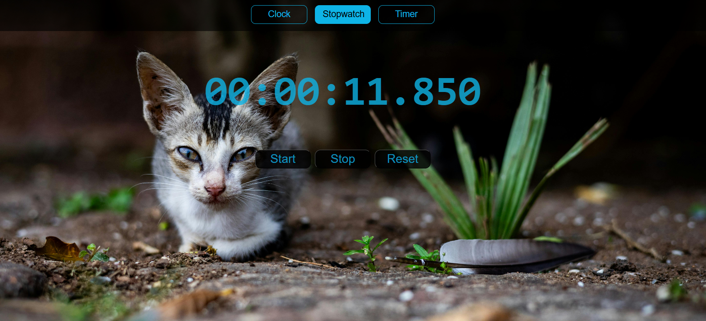

 # ⏱️ React Time Tools  

A simple and interactive **React app** featuring a **Digital Clock, Stopwatch, and Countdown Timer** — built with React hooks (`useState`, `useEffect`, `useRef`).  
Designed as a learning project and a handy demo of time-based utilities in React.  

---

## 📌 Description  
React Time Tools provides three essential time utilities with a clean digital UI:  
- **Digital Clock** – always-on clock with AM/PM  
- **Stopwatch** – millisecond precision, start/stop/reset  
- **Countdown Timer** – custom time input and live countdown  

---

## 🛠️ Tech Stack
- ⚛️ React (Vite)  
- 🎨 CSS (custom styles)  
- 🔧 React Hooks (`useState`, `useEffect`, `useRef`)  

---

## 🚀 Features
- 🕒 **Digital Clock** – real-time with AM/PM  
- ⏱️ **Stopwatch** – start, stop, reset with ms precision  
- ⏳ **Countdown Timer** – editable input & countdown  
- 🎨 **Minimal UI** – clean and easy to use 

---

  ## 📂 Project Structure
src/
├── App.jsx
├── Time.jsx # Digital Clock
├── StopWatch.jsx # Stopwatch
└── index.css # Styles


---

## 🛠️ Installation & Setup

1. Clone the repo
   ```bash
   git clone https://github.com/Naro56/react-time-tools.git
   cd react-time-tools
   ```

2. Install dependencies
   ```bash
   npm install
   ```

3. Start development server
   ```bash
   npm run dev
   ```

4. Open in browser:
   ```
   http://localhost:5173/
   ```

---

## 🎨 Screenshots




---

## 💡 Future Improvements
- ⏰ Add Alarm feature  
- 📋 Add Lap functionality for Stopwatch  
- 🎵 Add sound notification when Timer ends 
- 🌙 Dark mode support 

---

## 📜 License
This project is open-source and available under the MIT License.
