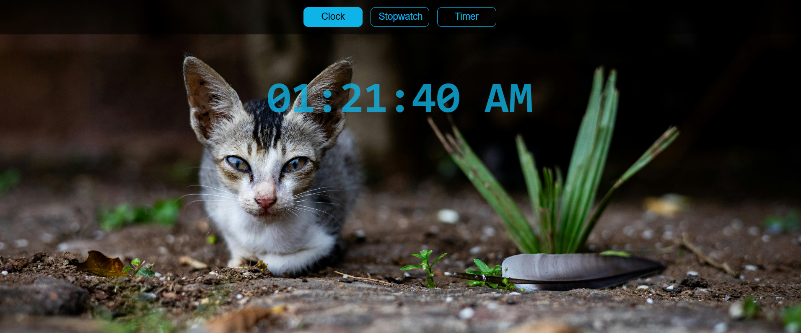
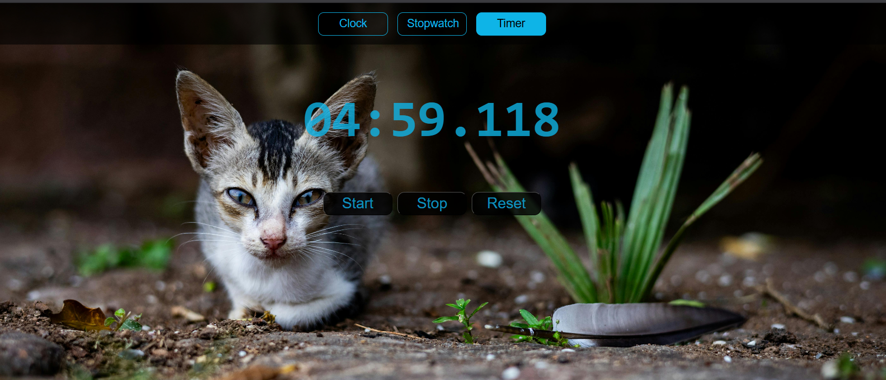

  # ⏱️ React Time Tools

  A React app featuring a **Digital Clock, Stopwatch, and Countdown Timer** — built using React hooks (`useState`, `useEffect`, `useRef`).  
  This project is designed as a learning exercise and a handy demo of time-based utilities in React.

  ---

  ## 📌 Repo Description
  A React app featuring a Digital Clock, Stopwatch, and Countdown Timer — built with React hooks (useState, useEffect, useRef) for learning and practice.

  ---

  ## 🚀 Features
  - 🕒 **Digital Clock** – real-time clock with AM/PM format  
  - ⏱️ **Stopwatch** – start, stop, reset with millisecond precision  
  - 🎨 Clean digital-style UI  

  ---

  ## 📂 Project Structure
src/
├── App.jsx
├── Time.jsx # Digital Clock
├── StopWatch.jsx # Stopwatch
└── index.css # Styles


---

## 🛠️ Installation & Setup

1. Clone the repo
   ```bash
   git clone https://github.com/Naro56/react-time-tools.git
   cd react-time-tools
   ```

2. Install dependencies
   ```bash
   npm install
   ```

3. Start development server
   ```bash
   npm run dev
   ```

4. Open in browser:
   ```
   http://localhost:5173/
   ```

---

## 🎨 Screenshots




---

## 💡 Future Improvements
- ⏰ Add Alarm feature  
- 📋 Add Lap functionality for Stopwatch  
- 🎵 Add sound notification when Timer ends  

---

## 📜 License
This project is open-source and available under the MIT License.
